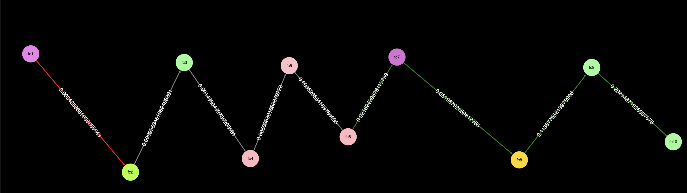

# Gradient Visualization Project

## Overview

This project is designed to visualize the gradients of a neural network during the backpropagation process. By capturing and visualizing gradient norms through hooks, it provides insights into how the gradients flow across the network layers during training. The generated graph, as shown below, illustrates the magnitude of gradients at each layer and the connections between them.



## Features

- **Gradient Hooks**: Automatically attach hooks to neural network layers to capture gradient norms during backpropagation.
- **Visualization**: Generate a graph to display gradient norms as node sizes and edge thickness/colors to highlight gradient flow dynamics.
- **Threshold-based Coloring**: Edges are shaded green if the gradient norm exceeds a threshold and red if it is below the threshold, providing an intuitive representation of gradient health.

## Use Cases

1. **Debugging Vanishing/Exploding Gradients**: Identify layers where gradients become too small or too large, which can hinder effective training.
2. **Model Optimization**: Optimize layer design and learning rates based on gradient flow analysis.
3. **Educational Purposes**: Demonstrate backpropagation and gradient flow concepts visually.

## How It Works

### Gradient Hooks

The project uses PyTorch's `register_full_backward_hook` to attach hooks to layers of the neural network. The hook function captures the gradient norms of the layer weights during backpropagation. Below is a simplified code snippet from the project:

```python
# Hook to capture gradient norms
def backward_hook(module, grad_input, grad_output):
    if hasattr(module, 'weight') and module.weight.grad is not None:
        training_data["nodes"].append({
            "id": module.__class__.__name__,
            "gradient_norm": module.weight.grad.norm().item()
        })
```

### Gradient Norm Calculation

The gradient norm for a layer is calculated as:

where  is the gradient of the -th weight parameter in the layer.

### Gradient Thresholding

To color the edges in the graph:

- **Green**: Gradient norm > 0.01
- **Red**: Gradient norm <= 0.01

The thresholds can be adjusted based on the specific requirements of the project.

### Visualization Details

- **Nodes**: Represent layers, sized proportionally to the gradient norm.
- **Edges**: Represent connections between layers, colored and thickened based on the gradient norm.

## Instructions to Use

1. **Clone the Repository**:
   ```bash
   git clone <repository_url>
   cd gradient-visualization
   ```
2. **Set Up Conda Environment**:
   If you are using Conda, you can create the environment from the provided `environment.yml` file:
   ```bash
   conda env create -f environment.yml
   conda activate gradient-visualization
   ```
3. **Install Dependencies**: Ensure you have Python and PyTorch installed. If you are not using Conda, install dependencies using the following command:
   ```bash
   pip install -r requirements.txt
   ```
4. **Run the Training Script**: Execute the training script to capture gradients:
   ```bash
   python extract.py
   ```
   This will save gradient data to `training_output.json`.
5. **Generate Visualization**: Use the provided visualization tool to generate the graph. For example:
   ```bash
   python visualize.py
   ```

## Example Data

Below is a snippet of the captured data:

```json
{
    "nodes": [
        {
            "id": "Linear",
            "gradient_norm": 0.8044
        },
        {
            "id": "Linear",
            "gradient_norm": 0.5383
        }
    ],
    "edges": [
        {
            "source": "fc1",
            "target": "fc2",
            "gradient_norm": 2.9235
        }
    ]
}
```

## Mathematical Background

Gradient flow is critical for effective neural network training. Poor gradient flow can result in:

- **Vanishing Gradients**: Gradients approaching zero, causing the network to stop learning.
- **Exploding Gradients**: Gradients becoming excessively large, destabilizing training.

### Backpropagation Equation

During backpropagation, gradients are calculated as:

where:

-  Loss function
-  Model parameters
-  Activation
-  Weighted input

This project leverages these computations to extract gradient norms for visualization.

## Future Work

- Support for convolutional and recurrent layers.
- Interactive visualization in web browsers.
- Real-time gradient visualization during training.

## Acknowledgments

This project uses PyTorch for gradient computation and network training and Flask for API-based data handling.

---

Feel free to contribute by submitting issues or pull requests!

